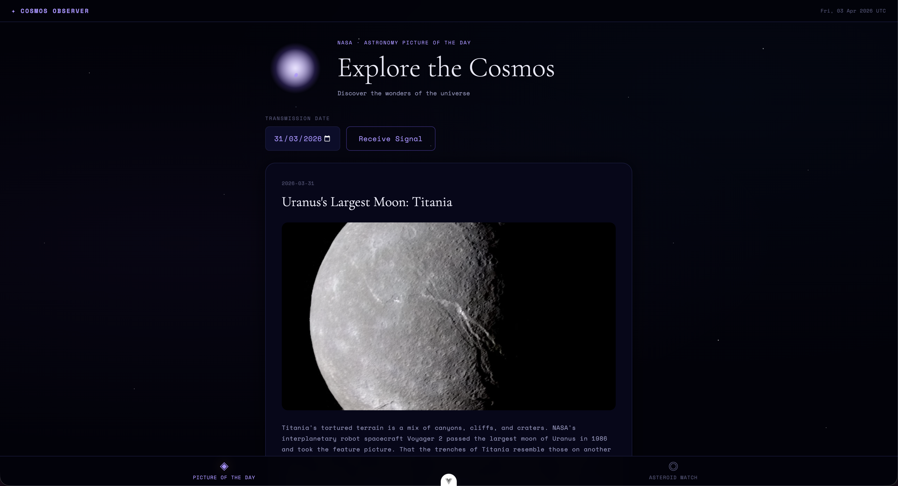
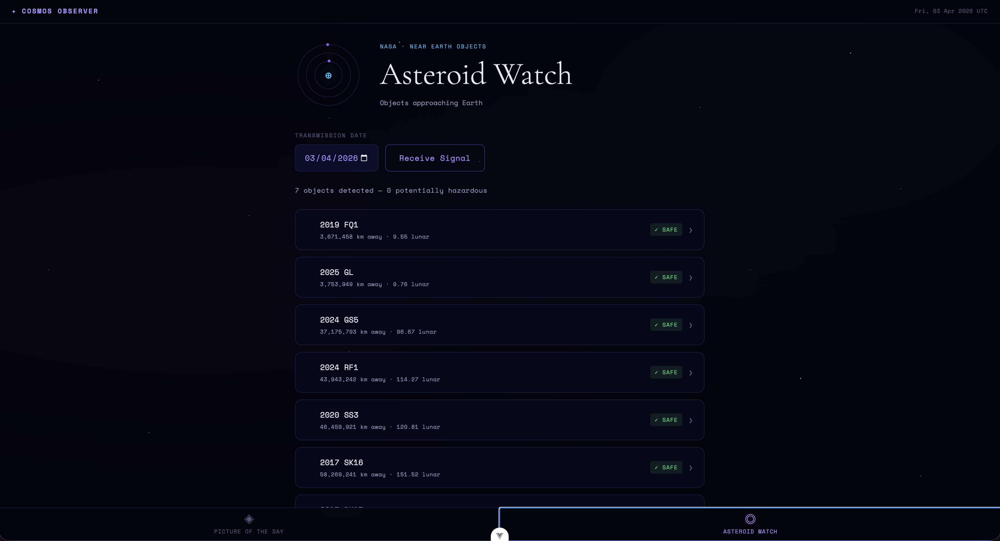

# Cosmos Observer

A deep-space observatory interface for browsing NASA's universe data. Navigate between two views — the Astronomy Picture of the Day and a live Asteroid Watch — using a persistent bottom navigation bar.

> Built with Vue 3 (Composition API), Vite, and plain CSS custom properties.


**Live site:** https://myapp-vue.vercel.app

---

## Features

### ◈ Picture of the Day

Loads today's NASA Astronomy Picture of the Day automatically on open. Pick any date from 16 June 1995 onwards and click **Receive Signal** to load that day's image or video alongside its title, description, date, and copyright.


### ◎ Asteroid Watch

Loads Near Earth Objects approaching Earth today automatically on open. Asteroids are sorted by proximity to Earth. Click any card to expand it and see:

- Velocity (km/h)
- Estimated diameter range (metres)
- Closest approach date and time
- Orbiting body
- Link to the JPL Small Body Database entry

Potentially hazardous asteroids are flagged in red with a pulsing dot. The date picker accepts dates up to 2100-12-31 for predicted future approaches. A banner appears when a future date is selected.


---

## Tech stack

|                    |                                                                   |
| ------------------ | ----------------------------------------------------------------- |
| Framework          | Vue 3 — `<script setup>`, Composition API                         |
| Build tool         | Vite                                                              |
| Styling            | CSS custom properties — all tokens in `src/lib/styles/tokens.css` |
| Fonts              | Space Mono · Cormorant Garamond via Google Fonts                  |
| APIs               | NASA APOD API · NASA NeoWs API                                    |
| Component tests    | Vitest + Vue Testing Library                                      |
| E2E tests          | Playwright (Chromium + Firefox)                                   |
| Component explorer | Storybook 8                                                       |
| CI                 | GitHub Actions                                                    |
| Deployment         | Vercel                                                            |

---

## Getting started

### 1. Clone and install

```bash
git clone https://github.com/your-username/cosmos-observer-vue.git
cd cosmos-observer-vue
npm install
```

### 2. Add your NASA API key

Create a `.env` file in the project root:

```
VITE_NASA_API_KEY=your_key_here
```

Get a free key at [api.nasa.gov](https://api.nasa.gov). Without one the app falls back to `DEMO_KEY`, which is rate-limited to 30 requests/hour per IP.

> ⚠️ Never commit your `.env` file — it is listed in `.gitignore`.

### 3. Start the dev server

```bash
npm run dev
```

Opens at **http://localhost:5173**

---

## Scripts

| Script                         | What it does                                    |
| ------------------------------ | ----------------------------------------------- |
| `npm run dev`                  | Start Vite dev server                           |
| `npm run build`                | Production build into `dist/`                   |
| `npm run preview`              | Serve the production build locally              |
| `npm run lint`                 | ESLint — reports issues, no autofix             |
| `npm run format:check`         | Prettier — checks formatting, no autofix        |
| `npm run format`               | Prettier — fixes formatting in place            |
| `npm run test`                 | Vitest — single run, exits when done            |
| `npm run test:watch`           | Vitest — watch mode for development             |
| `npm run e2e test`             | Playwright — headless, Chromium + Firefox       |
| `npm run e2e test -- --ui`     | Playwright — interactive UI mode                |
| `npm run e2e test -- --headed` | Playwright — visible browser window             |
| `npm run storybook`            | Storybook dev server on port 6006               |
| `npm run build-storybook`      | Build static Storybook into `storybook-static/` |

---

## Project structure

```
myapp-vue/
├── src/
│   ├── App.vue                        # Shell: observatory bar + bottom nav
│   ├── main.js                        # App entry point, imports tokens.css
│   ├── lib/
│   │   ├── api/
│   │   │   ├── Apod.js                # APOD API wrapper
│   │   │   └── Neo.js                 # NeoWs API wrapper
│   │   ├── components/
│   │   │   ├── Apod/
│   │   │   │   ├── ApodHeader.vue     # Heading + ApodVisual
│   │   │   │   ├── ApodVisual.vue     # CSS orbiting particle animation
│   │   │   │   ├── ApodDatePicker.vue # Date input + Receive Signal button
│   │   │   │   ├── ApodImage.vue      # Renders  or <iframe>
│   │   │   │   └── ApodCard.vue       # Full result card
│   │   │   └── Neo/
│   │   │       ├── NeoHeader.vue      # Heading + NeoOrbitVisual
│   │   │       ├── NeoOrbitVisual.vue # Animated orbital rings
│   │   │       ├── NeoList.vue        # Count summary + list of NeoCards
│   │   │       └── NeoCard.vue        # Expandable asteroid detail card
│   │   ├── styles/
│   │   │   └── tokens.css             # All CSS custom properties
│   │   └── views/
│   │       ├── ApodView.vue           # APOD page — auto-loads today on mount
│   │       └── NeoView.vue            # NEO page — auto-loads today on mount
│   └── stories/
│       └── Cosmos.stories.js          # Storybook stories
├── tests/
│   ├── setup.js                       # Vitest global setup
│   ├── Apod.test.js                   # Component tests — all APOD components
│   └── Neo.test.js                    # Component tests — all NEO components
├── e2e/
│   └── Cosmos.spec.js                 # Playwright e2e tests
├── .github/workflows/
│   └── ci.yml                         # CI: lint + format + test + e2e
├── playwright.config.js
├── vitest.config.js
└── vite.config.js
```

---

## CI / CD

Every pull request to `main` triggers two parallel GitHub Actions jobs:

**Lint, Format and Test** — runs ESLint, Prettier check, and Vitest in sequence. All three must pass.

**E2E Tests** — installs Playwright browsers, starts the Vite dev server automatically via the `webServer` config in `playwright.config.js`, then runs the full suite against Chromium and Firefox. The HTML report is uploaded as a workflow artifact on every run.

Merging to `main` triggers an automatic deployment to Vercel.
